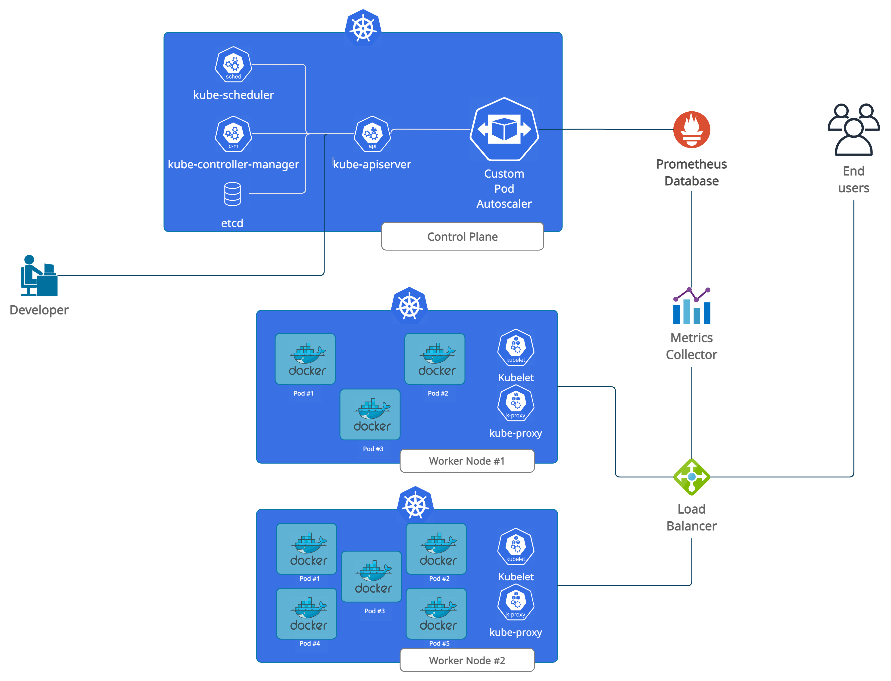

# HPA-performance-optimization-for-containerized-applications

## Objective

The objective of [this](https://github.com/suju7/HPA-performance-optimization-for-containerized-applications/blob/master/Master%20Thesis%20Sujatro.pdf) dissertation is to improve the functioning of Horizontal Pod Autoscaling (HPA) in Kubernetes. We will explore the need for containerization and using microservices with Docker. We will study the architecture of Kubernetes and its vertical and horizontal autoscaling services. Next we aim to propose a “custom” pod autoscaler that would fit in the existing Kubernetes architecture (shown in the picture below).

This proactive custom autoscaler shall be a time-series based autoscaler. We will discover some of the time-series forecasting models we have today and compare the results to find out which one gives the most suitable result. This model will be the core of our custom autoscaler component and it should work to enhance the working of HPA in managing pod deployment. This paper should provide a comprehensive guide to anyone trying to understand containerized applications and autoscaling features of Kubernetes.

The error scores are as follows: (The code can be found in the [codes directory](https://github.com/suju7/HPA-performance-optimization-for-containerized-applications/tree/master/codes))

| Model Type | MAE | RMSE | NRMSE
| --- | --- | --- | --- 
| ARIMA | 813.779 | 1030.451 | 0.148 
| SARIMAX | 949.059 | 1172.071 | 0.168 
| Prophet | 360.193 | 510.246 | 0.073
| LSTM | 342.605 | 422.780 | 0.061 
| GRU | 301.383 | 413.783 | 0.059
| BiLSTM | 287.900 | 380.991 | 0.055

We see that the BiLSTM model has outperformed all the other models. It is more accurate and a lot faster than the ARIMA model, especially in long term forecasting. Its speed is comparable to the LSTM and GRU models, when examined with different workloads.
